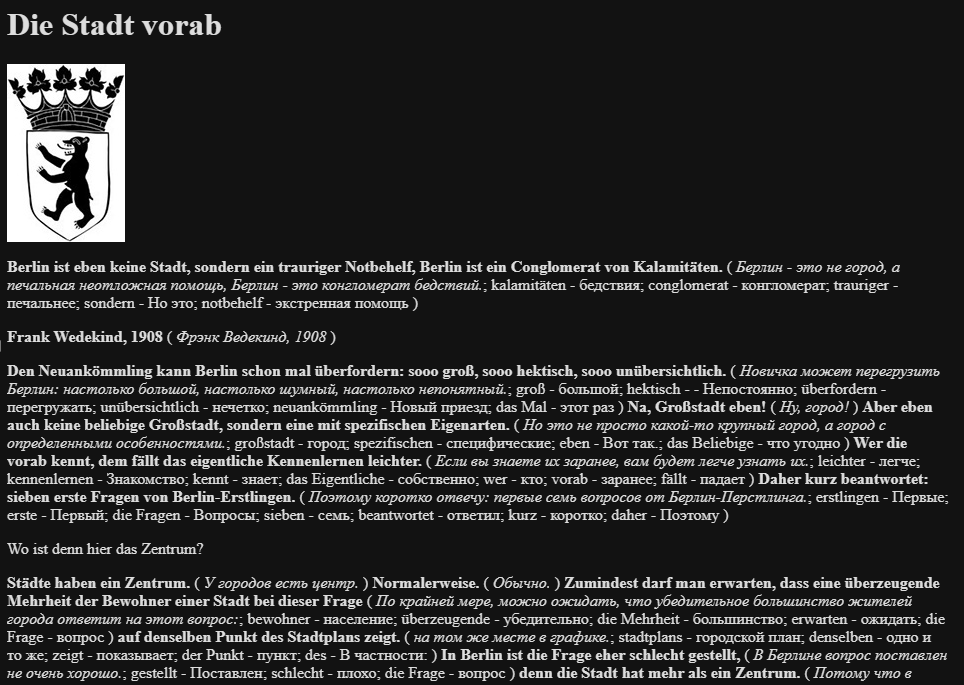

# German to bilingual German-Russian EPUB Translator
This tool can be used for translation between ANY languages.
All scripts are created just for fun. By default, it converts German EPUB text into a bilingual German-Russian format.

## book_nllb.py
Translates German EPUB text into a bilingual German-Russian format. The solution utilizes NLLB and KeyBERT. You can use it to translate between any languages by specifying the src_lang and tgt_lang parameters.

Just use VS Code and a devcontainer to run the script.

## convert_sqlite.py
Reads German nouns from JSON, stores them in an SQLite database. For use with book_nllb.py.

## german_nouns_output.json
https://github.com/Hanttone/der-die-das-game/blob/master/data/german_nouns_output.json

## book_gemma.py
Translates German EPUB text into a bilingual German-Russian format using Gemma 3 with assistance from Ollama. Generates natural, structured JSON translations, stores translations and word frequencies, and supports customizable word filtering. Designed for testing purposes—performance is slow.
There is no setup environment for this script — it's just demonstration code.
